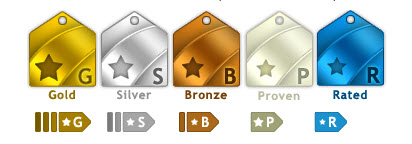
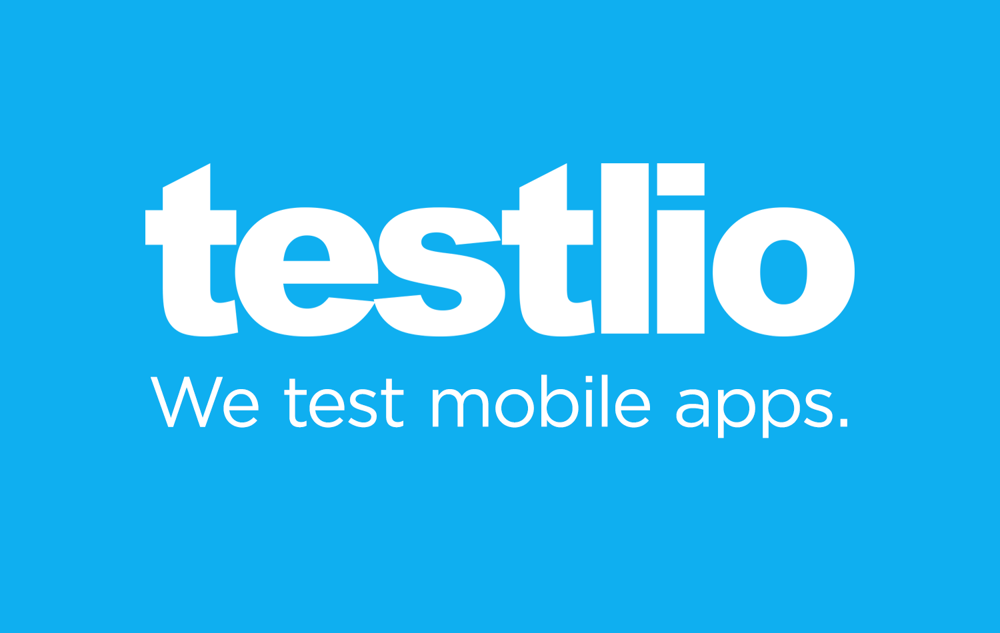

# So You Think You Can Freelance

[Presentation Slides](https://slides.com/ryandoll/troubleshoot-like-a-boss)

## Overview

You’ve likely seen the listings of “Work from Home” jobs or heard or read tips from people about how easy it is to work as a freelancer. Did you know there are freelance testing jobs as well?

In this talk, we’ll learn about tips for becoming a successful freelancer, the different websites where you can become a freelance tester, how to build/establish your reputation as a tester, and most importantly, how to make money as a freelance tester.

## Speaker

Dusty Juhl is a QA professional with over 13 years of IT experience. He is a [Certified Scrum Master](https://www.scrumalliance.org/certifications/practitioners/certified-scrummaster-csm) (CSM), a [Certified Software Tester](http://www.softwarecertifications.org/cste/) (CSTE), and he’s currently the Vice President / Treasurer of the [Des Moines Area Quality Assurance Association](http://www.daqaa.com_) (DAQAA). He’s an active member of a number of user groups in the local community. When he’s not crushing bugs, he’s cheering on his 2016 World Series Champion [Chicago Cubs](https://www.mlb.com/cubs) or willing the [Dallas Cowboys](http://www.dallascowboys.com/) onto another Super Bowl title.

You can find Dusty online.
- [Email](mailto:dustyjuhl@gmail.com)
- [Facebook](https://www.facebook.com/dustyjuhl)
- [GitHub](https://www.github.com/dustyjuhl)
- [LinkedIn](https://www.linkedin.com/in/dustyjuhl)
- [Twitter](https://twitter.com/DustyJuhl)

## Why Freelancing?
- Earn extra income
  - You can earn up to $500 before having to report it to the IRS
  - As you gain experience and build your reputation, you can earn more money.
  - You can earn up to $35/hr. on some sites.
  - Some freelance sites offer the opportunity to become employees.
- Gain additional experience
  - Work on fun projects
  - Work for major brand name companies
  - Learn new things
- Be your own boss
  - Set your own schedule
  - Work at your own pace
  - Work wherever you want—home office, kitchen table, coffee shop, or from your own bed

## Tips for Being Successful
Source: http://www.inc.com/jordan-kasteler/7-freelance-habits-you-should-develop-before-quitting-your-day-job.html

1. Manage Your Time Efficiently: The most common habit successful freelancers develop is the ability to manage their time effectively. Find a tactic that works for you, and then use it as often as you may need, as long as it helps you manage your time.

2. Treat Yourself Right: There is always work to do. But forgetting that you're only human will lead to a mental break. So, don't forget to take breaks. Give yourself a day or two off periodically. Make sure you get out into the world. Do whatever you need to keep yourself in good spirits and good health.

3. Don’t Let Rejection Tear You Down: It's best to be prepared for the inevitable when becoming a serious freelancer. Simply being aware that rejection happens is a big first step. Many of these testing projects will have well defined requirements specifying geography (despite being conducted online), particular clients, etc. Keep in mind that your skills have worth, and you'll find a client who sees it as well.

4. Take Some Risks: Take on daunting projects. Challenge yourself to learn new things. If you don't go out there and try new things, your career will become stagnant.

5. Have Something Fun to Do: Whether a project for a client or one that you accomplish in your spare time, make sure you're doing something fun. This will help you keep your perspective, remind you why you started, and help you relax even when you're working.
Especially when beginning, freelancers can get caught up doing the same type of projects over and over. Not only is this damaging for a new portfolio, it's also boring and repetitive.
Repetitive jobs become harder to do--just because it's harder to keep focused on them. Make sure to (at least occasionally) take a job that sounds like fun.

6. Don’t Forget Why You Started: Don't forget that you started freelancing not because you had no choice, but because you love it.
In the business that develops, never forget your passion. If you do, it'll be worse than neglecting every other piece of advice out there.
No spark reflects in your work. If you lose your passion and love for your craft, not only will it be hard for you to continue to motivate yourself, but you'll start to put out lower quality work. This can be disastrous--so make sure you take time to remind yourself of your love for your work.

## Freelance Testing
- uTest – https://www.utest.com/
- Testlio – https://testlio.com/
- Ubertesters – https://ubertesters.com/
- TestFairy - https://testfairy.com/

## [uTest](https://www.utest.com/)

- Based in Framingham, MA
- 250,000+ testers
- Two options:
  - Lite user
  - Full user (for paid projects)
- uTest paid out more than $20,000,000 to testers in the past year.

## uTest Lite
What is a uTest Lite profile?

- A uTest Lite profile gives you access to site features on uTest.com. It means you can:
  - Comment on blog posts
  - Rate and review [uTest University](https://www.utest.com/courses) courses
  - Rate and review tools
  - Read and participate in the forums

## uTest Full user
- Full user signup
  - Step 1 - Account Information
  - Step 2 - Hardware & Software
    - WEB AND DESKTOP
      - Operating System
      - Operating System Version
      - Operation System Language
      - Firewall
      - Antivirus
      - Antispyware
      - Browsers
      - Accessories
      - Headset
      - Microphone
      - Speakers
      - Webcam
    - MOBILE AND TABLET
      - Add Devices
        - Handset Manufacturer
        - Handset Model
        - Handset Operation System
        - Wireless Carrier
    - SMART TV AND OTHER
      - Categories
        - Smart TVs
        - Gaming Consoles
        - Wearables
        - Smart Blu-Ray Players
        - Set Top Boxes
        - Home Appliances
        - Autos
        - TV Provider

## [How to Get Started](https://www.utest.com/earning-money)
Step 1: Complete a Full uTest Profile

uTest matches projects to those testers who meet the specific customer criteria. By keeping your profile up-to-date, you increase the likelihood of getting invited to paid projects.

Step 2: Show us Your Skills

uTest invites testers to an audition -- called the uTest Sandbox -- so they can see how projects work, understand the uTest platform, and show off their skills.

[Sandbox 101](https://help.utest.com/sandbox/) - 
The uTest Sandbox 101 is a program that provides newly registered (or currently unrated) uTesters with the opportunity to evaluate uTest, and likewise an opportunity for uTest to evaluate new uTesters. This involves participating in an unpaid “audition” test cycle that closely mimics a regular, paid uTest test cycle.

Step 3: Further Sharpen Your Skills

uTest provides free [Courses](https://www.utest.com/courses). Taking these courses will ensure that you are primed for success when you begin to take on paid projects.

## [Test Cycle Types](https://www.utest.com/courses/skill-tree)
uTest offers several types of testing projects to appeal to many types of software testers.

There’s a section of your profile titled "Testing Settings" where you need to select at least one testing type (outlined below), and a section titled "Hardware & Software" where you must select at least one app type (Mobile, Web, etc). To match you with the best opportunities you are encouraged to select only the testing types you are familiar with or have had some experience in.

- Crowd Sourced Community Test Cycles:
  - Functional: Exploratory testing and test case completion
  - Usability: Survey completion
  - Localization: Translation validation and localization testing

- Expert Sourced Community Test Cycles:
  - Automation: Automated test script creation
  - Usability: Usability audits, survey creation, survey analysis and expert review
  - Security: Manual penetration and dynamic security testing
  - Load and Performance: Script creation and expert review

## [Tester Ratings](https://www.utest.com/courses/utest-tester-ratings)
How am I rated as a tester?

All testers are rated against other active members of the community based on their quality and activity level (tester rating calculations are performed on a daily basis). There are a total of five tiers for the rated tester: Gold, Silver, Bronze, Proven, and Rated tier (if you do not have a badge, this simply means that you have not filed enough "activity" points). Testers can be Gold in Functional testing, and be lower or even unrated in other testing types.

Gold/Silver/Bronze testers receive higher payout rates than other members of the testing community: Gold testers receive a 10% premium on all approved reports, while Silver and Bronze testers receive a 5% and 2.5% premium, respectively. Payout increases are determined by the rating that applies to the test cycle's testing type.

## Additional Resources
- [uTest Help Courses](https://help.utest.com/)
- [Rules of Engagement](https://www.utest.com/rules-of-engagement)
- [Getting Started with uTest Paid Projects](https://www.utest.com/courses/getting-started)
  - [uTest 101 Quiz](http://surveys.utest.com/surveys/utmr/utest-101-quiz-2015/?collector=182248)
  - [Sandbox 101](https://help.utest.com/sandbox/)
- [Earning Money](https://www.utest.com/earning-money)
- [How do payments work at uTest?](https://www.utest.com/courses/payments)
- [When am I paid?](https://help.utest.com/when-am-i-paid/)
- [Do I need to submit a W-9?](https://help.utest.com/need-submit-w-9/)
- [Software Testing Paid Projects](https://www.utest.com/projects?tab=all)
- [Submitting Bug Reports at uTest](https://www.utest.com/courses/participation-submitting-bug-reports)
- [How to Write a Quality Bug Report](https://www.utest.com/courses/writing-quality-bug-reports-and-utest-etiquette)
- [Best practices for uTest attachments](https://www.utest.com/articles/best-practices-for-utest-attachments)
- [uTest Tester Ratings](https://www.utest.com/courses/utest-tester-ratings)
- [uTest Blog](https://www.utest.com/utest-blog)
- [Software Testing Forums](https://www.utest.com/forums)
- [Software Testing Courses](https://www.utest.com/courses)
- [Course Tracks](https://www.utest.com/course-track)

## [Testlio](https://testlio.com/)

[What's Testlio?](https://testlio.com/for-testers/)
- Testlio is based in San Francisco, CA and Tallinn, Estonia
- Testlio is a community of testers that help companies make sure their products work.
- Testlio emphasizes that Quality matters.

Testing shouldn’t be based off of the number of bugs you catch. What matters is the impact you have on the end product. Testlio values the quality of the bugs you find, rather than the quantity.

1. Get verified - Each tester goes through our verification process to make sure our community is made up of expert testers.
2. Crush bugs - Once you’ve been verified, you will be invited to a project you can work on around your own schedule.
3. Get paid - Make up to $35/hr for doing what you love. After each test cycle you will receive payment for the hours you’ve been assigned to test.

## [Tester FAQ](https://platform.testlio.com/tester-faq)
- What is Testlio?
- Why is this better?
- How do I get started/invited to a project?
- How much do I get paid?
- What's it like being a tester?
- How do the hours work?
- How do I get paid?
- Do you care what tools we use?
- What is my tester rating based on?

  Your tester rating is based on four factors:
    - Bug depth: How critical were the bugs you reported?
    - Timeliness: Did you submit the bugs on time?
    - Ability to follow directions: Were the bugs you submitted in the scope of the test cycle?
    - Report Quality: How clean and readable was your bug report? Could a five-year old reproduce the bug?

  After the test cycle is over a Test Lead will rate you on these four areas. The higher your score is, the better your chances of being invited to more test cycles.

## Tester Benefits
- Testlio only works with the top testers in the world. When you join Testlio, you’re going to be working with other amazing testers whom you can learn from and work with.
- Work on exciting and interesting projects
- Work with huge brands
- Work with other top testers and sharpen your skills
- Testlio rewards testers who are great team players and bring value to the customers
- Test whenever the time works best for you
- Pay starts at $10/hr but can increase to over $35/hr

## Resources to Help You Get Started
- [Intro video](https://vimeo.com/129539889)
- [How to report bugs effectively](https://testlio.com/blog/kiss-method-for-bug-reporting/)
- [Expectations of you as a tester](https://testlio.com/blog/the-10-core-values-all-expert-testers-have-in-common/)

## [Ubertesters](https://ubertesters.com/)

What's Ubertesters?
- Based in Ridgewood, NJ
- The perfect tool for QA Managers: Track all testing sessions in real-time using the Ubertesters dashboard. Distribute builds to your team members over-the-air. Create distribution groups for A/B testing of your iOS and Android apps. Get a real picture of testers work and review testers’ activity videos. Improve your app based on test-cases execution results, beta testers’ feedbacks, crashes and detailed issues reports. Manage the builds for enhanced security and export the issues to the most popular bug-tracking-systems.
- An easy way to get paid for testing: If you’re a skilled and talented QA professional who is excited about testing new products and reporting their flaws you should become a part of the Ubertesters community of testers. Receive new products for real life testing using your own device from the comfort of your own home. Report bugs with edited screenshots and video sessions recording directly from the tested app. Become part of their freelance software tester community and get paid for your efforts.
- The best platform to gather the beta testing team: Thousands of inquisitive minds are ready to look at your product and test it on any real device used by your clients. Transparent flat rates for all types of projects, no matter if you require exploratory testing or test cases execution. Create a scalable beta team by request including an experienced assigned project manager. No testers limits per task, apps type, location or project. Review results of your tester’s activity and communicate with us 24/7 for better time-to-market of a quality product.

## [Ubertesters for Enterprise App Testing](https://ubertesters.com/enterprise-app-testing/)
Trusted by some of the smartest companies:
- Verizon
- T-Mobile
- Intuit
- houzz
- The GOLF Channel

...and many others

[Hire Testers](https://ubertesters.com/need-testers/)
- Test your app globally – with experienced testers, on all types of real devices, under real-world conditions.
  - Professional Ubertesters on demand in 80+ countries!
- What do you get when hiring testers with Ubertesters?
  - Full access to the Ubertesters platform included ($129)
  - Personal Project Manager
  - Real-time activity monitoring
  - Functional, localization, exploratory, and usability testing
  - Multitudes of real devices

## [Join the Uber League of Testers!](https://ubertesters.com/become-tester/)
Become an Ubertester, earn money, and test pre-released amazing mobile apps and exciting games from the leading mobile developers around the world, and all in your spare time.

- Amazing projects from global brands
- Career opportunity - work hard and become a team-lead with your own team
- Get paid for the time spent on testing - every hours counts
- Flexible schedule - test apps in your spare time

1. Complete a short form - Tell us about yourself and your technical skills
2. Get certified - One of our managers will contact you shortly to complete the certification process
3. Test apps & earn money - Be the first who tests amazing apps from global brands. Do it in your spare time and earn money.

Managing your mobile testing has never been easier.
- Platform – Simplify your software beta testing activity, monitor and manage all processes and your teams in real time, using our award winning QA management tool.
- Crowdtesters - Test your app globally with experienced professional testers, on all types of real devices, platforms, locations, and carriers to ensure it is well-tested.

## [TestFairy](https://testfairy.com/)
